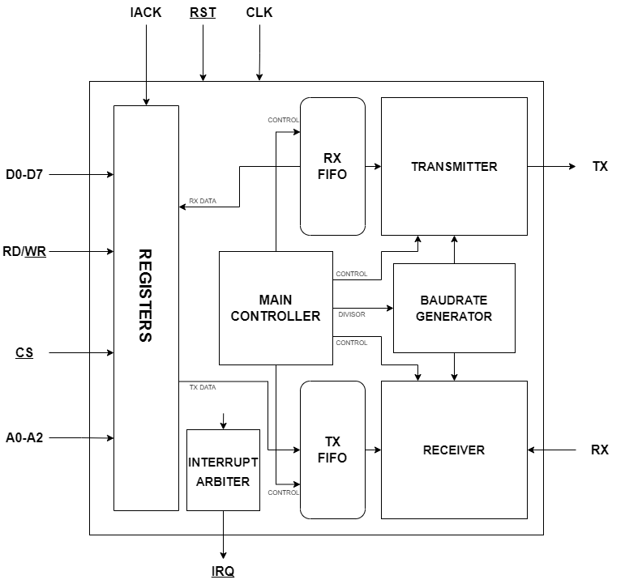
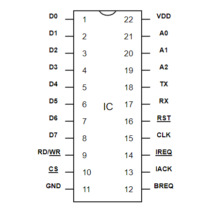
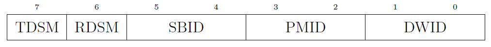
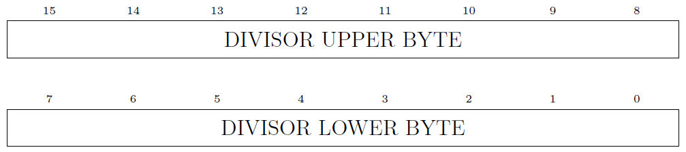
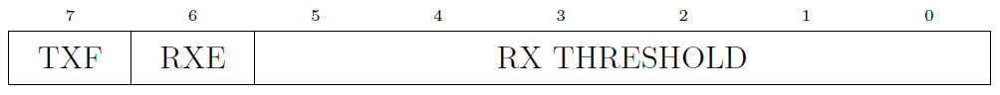
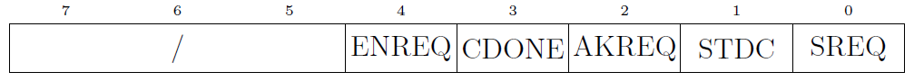
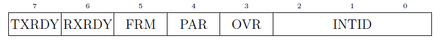
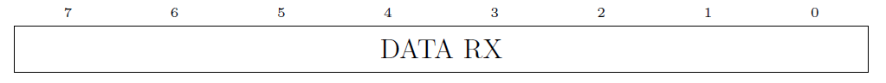
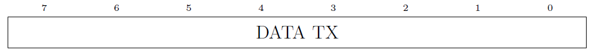

# Table of contents
- [Table of contents](#table-of-contents)
- [Introduction](#introduction)
  - [Features](#features)
- [Architecture](#architecture)
  - [Block Diagram](#block-diagram)
  - [Top Level View](#top-level-view)
  - [Signal Description](#signal-description)
  - [Configuration Protocol](#configuration-protocol)
    - [Data width packet](#data-width-packet)
    - [Parity mode packet](#parity-mode-packet)
    - [Stop bits number packet](#stop-bits-number-packet)
  - [Main Controller](#main-controller)
  - [Receiver](#receiver)
  - [Transmitter](#transmitter)
  - [Interrupt](#interrupt)
- [Registers](#registers)
  - [Status Register (STR)](#status-register-str)
    - [Fields Description](#fields-description)
  - [Divisor Register (DVR)](#divisor-register-dvr)
  - [FIFO Status Register (FSR)](#fifo-status-register-fsr)
    - [Fields Description](#fields-description-1)
  - [Control Register (CTR)](#control-register-ctr)
    - [Fields Description](#fields-description-2)
  - [Interrupt Status Register (ISR)](#interrupt-status-register-isr)
    - [Fields Description](#fields-description-3)
    - [Interrupt Table](#interrupt-table)
  - [Data Received Register (RXR)](#data-received-register-rxr)
    - [Fields Description](#fields-description-4)
  - [Data Transmitted Register (TXR)](#data-transmitted-register-txr)
    - [Fields Description](#fields-description-5)
- [Operations](#operations)
  - [Configuration](#configuration)
    - [Configuration request](#configuration-request)
    - [Enable configuration request](#enable-configuration-request)
    - [Transmitter Data Stream Mode](#transmitter-data-stream-mode)
    - [Receiver Data Stream Mode](#receiver-data-stream-mode)
  - [Transmission](#transmission)
  - [Reception](#reception)

# Introduction

  ## Features

# Architecture

  ## Block Diagram

  

  ## Top Level View

  

  ## Signal Description

  | Signal  | Direction | Description |
  | ------- | --------- | ----------- |
  | D0 - D7 | Input / Output | Data bus | 
  | WR/<ins>WR</ins>      | Input          | Read active high, write active low |
  | <ins>CS<ins>          | Input   | Chip select active low, if deasserted the data line is set in high impedance state
  | VDD | Input              | Power supply |
  | A0 - A2 | Input       | Address bus for registers |
  | TX      | Output         | Transmitter data line |
  | RX      | Input          | Receiver data line | 
  | <ins>RST</ins> | Input   | Reset active low  |
  | CLK       | Input        | Clock        |
  | <ins>IREQ</ins> | Output  | Interrupt request active low  |
  | GND | Input              | Ground       | 

  
  ## Configuration Protocol

  This UART controller implements a **configuration protocol** that enables two devices to change their configuration. An UART is a communication protocol that doesn't support **master/slave** configuration: two UARTs that share data have the same priority. In this UART architecture there is a master/slave configuration but only during the configuration process. The process is started once one of the two UARTs change their configuration state (*the device won't change his state until the configuration has ended*), at that point the device which changed his configuration first become the **master** and will dictate the data sent to the slave. The **slave** job is only acknowledging the packet of data received and to convert those packets into a valid device configuration.

  The process start with the sending of three `SYN` (0x16) data packet to advertise the slave device that a configuration request is being sent, if those packets are not received the configuration process cannot start, this enables the use of slower baud rate without starting configuration processes while sending data bits. 
  
  The configuration request is then sent by lowering the TX line (logic 0) for 1ms Once this is done, the master will **wait** for the slave to send an acknowledgment packet (0xFF), the   **wait lasts for 10ms**, if the slave doesn't respond in time, the master will send another request. This is done three times, if the other device doesn't respond for three times, a configuration error is generated.

  

  The valid bits are only 4 which enable sending the packet with every data width configuration supported. The **ID** defines the packet type (data width, stop bits number, parity mode), while the **OPTION** field defines the configuration.

  | ID | DESCRIPTION |
  | -- | ----------- |
  | 00 | End configuration packet
  | 01 | Data width packet
  | 10 | Parity mode packet
  | 11 | Stop bits number packet

  ### Data width packet

  | OPTION | DESCRIPTION | 
  | ------ | ----------- | 
  | 00     | 5 bits
  | 01     | 6 bits
  | 10     | 7 bits
  | 11     | 8 bits

  ### Parity mode packet

  | OPTION | DESCRIPTION | 
  | ------ | ----------- | 
  | 00     | Even
  | 01     | Odd
  | 10     | Disabled
  | 11     | Disabled

  ### Stop bits number packet

  | OPTION | DESCRIPTION | 
  | ------ | ----------- | 
  | 00     | 1 bit
  | 01     | 2 bits
  | 10     | Reserved (set 1 bit)
  | 11     | Reserved (set 1 bit)

  The **end configuration packet** has 00 in the **OPTION** field.

  Once the master has finished sending a packet the slave must acknowledge it, this **handshake** procedure runs until every packet has been sent.

  ## Main Controller

  The main controller is the module that enables the configuration process between two devices. It's a big FSM, at the reset it's setted in the `MAIN` state, the configuration is the standard one which is defined in the `UART_pkg.sv` file.
  
  If the CPU writes into the `STR` register and at least one of the three configuration fields (data width, stop bits number and parity mode) is changed, the controller waits for the RX and TX buffers to be empty, then sends a configuration request becoming the **master** (TX low for 1ms). Once the request is acknowledged within 10ms, the controller sends a series of configuration packets to the **slave device**, the slave must acknowledge every packet received. The process ends by sending of an `END CONFIGURATION` packet with the subsequent acknowledge.

  If the device, instead of sending the request, receives one, the controller sends an acknowledgment packet only if the request is acknowledged by the **user** by setting the `AKREQ` bit in the `CTR` register. At this point the device became the **slave**, for every configuration packet received, it sends an acknowledgment. The process ends with the reception of an `END CONFIGURATION` packet and the acknowledgment.

  If some errors happen during the configuration process (an illegal packet is received or the request isn't simply acknowledged), the controller will simply set the **standard configuration**.

  The main controller also is responsible for **parity error checking**, **communication mode** and **data stream mode** setup.  

  ## Receiver

  The receiver module is responsible for managing the right reception timing based on the device configuration and detecting a configuration request sent by the master device. 

  It contains a 64 bytes FIFO buffer which can be used with the **RX data stream mode** (DSM). Instead of interrupting every time the UART receives a packet of data (if DSM is disabled),  the device will interrupt once the buffer is **full** or the number of packets received match the **threshold** value which is stored into the `RX THRESHOLD` field of the **FSR** register.

  The receiver also checks the data integrity after receiving the data and generate proper error signals which are stored in a 64 x 3 bit FIFO buffer which is read/written with the data buffer. Once the packet is received, the module assert the `rx_done` signal and also `rxd_rdy` signal if the interrupt conditions are satisfied.

  The detection of the configuration request is done initially by checking every data packet received, a counter will keep track of the `SYN` packets received. Once three consecutive are sent, the receiver goes into a state where it checks that the RX line is held low for 1ms. Once this happens, it will generate a `configuration requested` signal. If during the request, the RX line is not stable low, the receiver will exit this state and will enter the `IDLE` state!

  ## Transmitter

  The transmitter module is responsible for managing the right transmission timing based on the device configuration and the generation of the configuration request signal. 
  
  It contains a 64 bytes FIFO buffer which can be used with the **TX data stream mode** (DSM) to send a burst of data: the CPU will write the `TXR` register multiple times, then wait for the transmitter to end its task. If the DSM is enabled, the transmitter will assert the `tx_done` signal once the buffer is empty, otherwise it will be asserted for every packet sent.  

  If the device wants to send a configuration request, the transmitter will lower the TX line for 1ms (logic 0), then it will enter the main state ready to send configuration packets. 

  ## Interrupt
  
  Any interrupt is managed by the **interrupt arbiter**. Since there are three different priority level, the arbiter must ensure that all the high priority interrupt are cleared before the low priority one, no matter the temporal order in which they are generated (even if it is highly unlikely that something like that happens given the CPU clock speed versus the UART one). 
  
  All the interrupts are generated by other modules (receiver, transmitter and main controller) and the signals that cause the interrupt must stay high for one clock cycle. 

  After the pulse is generated, the cause of the interrupt is saved in a FIFO buffer, there are three buffers in the arbiter, each one with a specific priority. Obviously, the cause of the interrupt is memorized in the corresponding priority FIFO.

  **Two clock cycles after** the generation of the interrupt, the pin <ins>IRQ</ins> is set to low to signal that an interrupt has been generated.

  To clear the interrupt, the CPU must first recognize that the UART has interrupted. If the CPU can manage interrupts then follows its routine, else the CPU must **poll** the `IPEND` bit in the **CTR** register: if an interrupt is pending, the bit will be set.
  
  After acknowledging the interrupt, the CPU must read the `INTID` field in the **ISR** register (read [Interrupt Status Register](#interrupt-status-register-isr)) to know what's the cause of it, then execute the corresponding operation to definitely clear the interrupt.

# Registers

  ## Status Register (STR)

  

  The status register contains the device current configuration except for the baud rate.

  **ADDRESS** : 0

  ### Fields Description

  | Field  | Access Mode | Description |
  | ------ | ----------- | ----------- |
  | TDSM   | `(R/W)`     | Enable _` data stream mode `_ for transmitter module.
  | RDSM   | `(R/W)`     | Enable _` data stream mode `_ for receiver module.
  | SBID   | `(R/W)`     | Set _` stop bit number `_ configuration ID.
  | PMID   | `(R/W)`     | Set _` parity mode `_ configuration ID.
  | DWID   | `(R/W)`     | Set _` data width `_ configuration ID.

  **SBID Field**
  | Value       | Description |
  | ----------- | ----------- |
  | `00`        | 1 stop bit. | 
  | `01`        | 2 stop bit. | 
  | `10`        | Reserved. | 
  | `11`        | Reserved. | 

  **PMID Field**
  | Value       | Description |
  | ----------- | ----------- |
  | `00`        | Even. | 
  | `01`        | Odd. | 
  | `10`        | Disabled. | 
  | `11`        | Disabled. | 

  **DWID Field**
  | Value       | Description |
  | ----------- | ----------- |
  | `00`        | 5 bits.     | 
  | `01`        | 6 bits. | 
  | `10`        | 7 bits. | 
  | `11`        | 8 bits. | 

 

  ## Divisor Register (DVR)

  

  The Divisor Register is a 16 bit register split in two different addressable register (`LDVR` and `UDVR`). Since the divisor is a 16 bit value and two registers can't be addressed at the same time, to read or write the entire value, two different operation must be executed. 
  
  The UART doesn't change its configuration until two writes on two of the two registers happens.

  **LOWER ADDRESS** : 1  
  **UPPER ADDRESS** : 2

 

  ## FIFO Status Register (FSR)

  

  The FIFO Status Register holds the state of both receiver and transmitter FIFOs. Notice how the only useful status flags are: the `full` flag for the transmitter FIFO: the `empty` flag is not really needed because an interrupt will occur when it's empty; the same thing for the `empty` flag for the receiver FIFO: the `full` flag is not really needed because an interrupt will occur when it's full. 

  If the programmer wants the device to interrupt when it receives a fixed amount of data, he can set a threshold for the receiver FIFO buffer.

  **ADDRESS** : 3

  ### Fields Description

  | Field  | Access Mode | Description |
  | ------ | ----------- | ----------- |
  | TXF    | `(R)`       | Transmitter FIFO `full` flag.
  | RXE    | `(R)`       | Receiver FIFO `empty` flag.
  | RX THRESHOLD | `(R/W)` | Forces the UART to interrupt when it receives an amount of data that equals that number. Any value between `RX_FIFO_SIZE` and `0` can be set (**those two values are illegal**).

 

  ## Control Register (CTR)

  

  The Control Register controls the state of the configuration request for both master and slave. A bit can also be set to set the device into standard configuration.

  **ADDRESS** : 4

  ### Fields Description

  | Field  | Access Mode | Description |
  | ------ | ----------- | ----------- |
  | IPEND  | `(R)`       | An interrupt is pending
  | COM    | `(R/W)`     | Communication mode. 
  | ENREQ  | `(R/W)`     | Enable the configuration process. 
  | CDONE  | `(R)`       | The configuration process has ended, this bit **must be polled** during every configuration process (both master and slave).
  | AKREQ  | `(W)`       | Acknowledge the configuration request sended by the master device, the device become slave.
  | STDC   | `(W)`       | Set standard configuration.

  **COM Field**

  | Value       | Description |
  | ----------- | ----------- |
  | `00`        | Disabled communication.     | 
  | `01`        | Simplex TX only. | 
  | `10`        | Simplex RX only. | 
  | `11`        | Full-Duplex. | 

 

  ## Interrupt Status Register (ISR)

  

  The Interrupt Status Register contains the interrupt status and enable bits, as well as a vector that give the cause of the interruption.

  **ADDRESS** : 5

  ### Fields Description

  | Field  | Access Mode | Description |
  | ------ | ----------- | ----------- |
  | RXRDY  | `(R/W)`     | Enable interrupt on data received (works with and without data stream mode). |
  | FRM    | `(R/W)`     | Enable interrupt on frame error. |
  | PAR    | `(R/W)`     | Enable interrupt on parity error. |
  | OVR    | `(R/W)`     | Enable interrupt on overrun error. |
  | INTID  | `(R)`       | Returns the interrupt ID with the highest priority.
  | IACK   | `(W)`       | Set this bit to acknowledge the interrupt, once it's cleared (the interrupt), the bit is resetted automatically.

  ### Interrupt Table

  | Cause   | Priority | ID      | Clear       |
  | ------- | -------- | ------- | ----------- |
  | Transmission done | 3 | `000` | Acknowledge interrupt
  | Configuration error | 1 | `001` | Acknowledge interrupt 
  | Overrun error | 1 | `010` | Read the data
  | Frame error | 1 | `011` | Read the data
  | Parity error | 1 | `100` | Read the data 
  | Data received ready | 2 | `101` | Standard mode: read RXR. Data stream mode: the fifo has reached his threshold read RXR till the buffer is empty.
  | Receiver fifo full | 2 | `110` | Standard mode: read RXR. Data stream mode: read RXR till the buffer is empty.
  | Requested configuration | 3 | `111` | Acknowledge the request or let the request expire.

 

  ## Data Received Register (RXR)

  
  
  The Data Received Register simply holds the data stored in the FIFO of the receiver.

  **ADDRESS** : 6
  ### Fields Description

  | Field   | Access Mode | Description   |
  | ------- | ----------- | ------------- | 
  | DATA RX | `(R)`       | Data received |

  
 

  ## Data Transmitted Register (TXR)

  

  The Data Transmitted Register holds the data that will be sent by the transmitter. 

  ### Fields Description

  | Field   | Access Mode | Description   |
  | ------- | ----------- | ------------- | 
  | DATA TX | `(W)`       | Data to be transmitted |

 

# Operations

  ## Configuration

  ### Configuration request

  This section describes the configuration process from both a hardware and a software point of view.

  To enable correct communication between two devices, those must agree on four different configuration parameters: *baud rate*, *data width*, *parity mode* and *stop bits number*.
  This protocol focus on the configuration of the last three parameter. To start a configuration process, the programmer must ensure that **both TX and RX FIFOs are empty**, then simply write in the `STR` register a different configuration, once the hardware detects a change in the parameters, it becomes the master and sends three `SYN` characters. Once the transmission is ended, it sends the request (TX low for 1ms). 
  
  At that point, the slave device detects the request: it will interrupt and **reset the TX FIFO!** So data will be lost. The slave then has 10ms to retrieve any data into the RX FIFO and acknowledge the request: **after the acknowledgment, the RX FIFO will be reset!** The acknowledgment can be done by setting the `IACK` bit into the `ISR` register. 
  Once the device (both master and slave) detects that a configuration process is happening, they will reset the `CDONE` bit in the `CTR` register.
  
  At this point, the hardware will completely take care of the process (see [configuration Protocol](#configuration-protocol) and [main Controller](#main-controller)). Once the configuration process ended, the `CDONE` bit will be setted, so after a configuration, that bit should be polled before sending any data.  

  ### Enable configuration request

  The programmer can choose between **two configuration modes** by setting or clearing the `ENREQ` bit in the `CTR` register. 
  
  If the bit is setted, then when a configuration parameter is changed (Data Width, Parity Mode or Stop Bits Number), the device respond by sending the new configuration to the other device. Multiple parameters can be changed with a single configuration request by simply accessing the register one single time.

  ### Transmitter Data Stream Mode

  The programmer can enable or disable the **data stream mode** by setting or clearing the `TDSM` bit in the `STR` register.

  If the data stream mode is **disabled**, once the transmission of a packet of data ended, the device will interrupt. If the programmer wants to send a stream of data, interrupting every time a packet is sent would slow the processor. **Data stream mode** can be enabled in this case: the processor will usually write a burst of data into the `TX FIFO`, then continue its task. The UART will transmit all the data until the FIFO will be **empty**, at this point the device will interrupt.

  ### Receiver Data Stream Mode

  The programmer can enable or disable the **data stream mode** by setting or clearing the `RDSM` bit in the `STR` register.
  
  If the data stream mode is not enabled, the device will
  interrupt every time a new packet is received. If enabled, the device will interrupt when the number of packet received equals the `RX THRESHOLD` value, if the value is set to zero, then the device will interrupt when the FIFO is full.

  ## Transmission

  Data can be sent serially by writing it in the `TXR` register. *Once the transmitter ended its task, the device will interrupt*. Multiple write can occur in the `TXR` while the transmitter is sending data, the data written in this case will be memorized in the `TX FIFO`.

  ## Reception  

  Once received and the device interrupted, the data can be retrieved through the `RXR` register, every time this operation occurs, the FIFO will write the next data into the register. This will happen until the FIFO is empty.